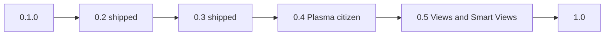

# Kurrent roadmap

Path from **0.1.0** to **1.0**: a daily-driver Plasma widget that installs without compiling from git, reads and writes **VTODO through Akonadi** (CalDAV/Nextcloud/Merkuro as the user already configured), supports **multiple main-pane views** (list, Kanban, swimlanes, project plan, heatmap, calendar+tasks), **saved Smart Views**, keyboard use, and a complete settings dialog.

**Principle:** **Akonadi remains the source of truth.** All task mutations go through Akonadi jobs; the plasmoid keeps an optimistic cache and shows pending/offline state — no parallel task database.

Still out of scope for 1.0: Markdown notes, binary attachments, a login of its own, a theme engine besides Plasma, free-form pixel padding, CalDAV without Akonadi, Flatpak.



## 0.1.0 today

Inbox, Today, Tomorrow, Scheduled, Anytime, Recurring, Unlabeled, Completed. Projects, labels, priorities. Create, edit, complete, delete. Subtasks via drag-and-drop. Full editor overlay and inline editor. Shared config between desktop and panel. Translations (de, es, fr, ja, zh_CN). A `.plasmoid` asset on GitHub Releases.

Configure Kurrent has KCM pages for General, Appearance, Sidebar, Tasks, Editor, Panel, Notifications, Projects, Labels. Spacing comes from `Design.qml` tokens; user overrides (sidebar width, density, colors) live in `~/.config/com.github.shrippen.kurrent/kurrentrc`.

---

## 0.2 — shipped 2026-08-18

**0.2.0** shipped the settings foundation, catch-up, and honest release notes. Distro packages are **not** in this repo yet; until AUR/COPR exist, install with `install-linux.sh` from GitHub Releases. The Store `.plasmoid` is widget UI only — it does not replace `libkurrentplugin.so`. See [CHANGELOG.md](CHANGELOG.md).

---

## 0.3 — shipped 2026-08-29

CalDAV semantics, editor/settings depth, panel and notification polish, backend version mismatch banner, i18n catalog (0.3.1). See [CHANGELOG.md](CHANGELOG.md).

**Deferred to later milestones:** creating Akonadi calendars from the widget, binary attachments (post-1.0 research).

---

## 0.4 — Plasma citizen + chrome settings

- Keyboard: focus search, new task, complete, delete, full editor, sidebar view switching, reschedule shortcuts.
- Global shortcut / D-Bus to open the flyout or add a task (`org.github.shrippen.Kurrent`).
- KRunner (`task tomorrow invoice`) — ship with 1.0 if cheap; not a hard blocker.
- Join button polish for `http(s)` meeting URLs on row and editor.
- Sidebar width, section/view order and visibility; per-project and per-label colors; panel badge; overlay dim steps.
- **Undo control in the main pane header** (all views): visible **Undo** button beside Sort / view switch; same one-step undo stack as today (complete / reschedule / move / delete); keyboard shortcut unchanged.

---

## 0.5 — Main-pane views + Smart Views (1.0 core UX)

The **large area right of the sidebar** is one **main pane**. Built-in sidebar entries (Inbox, Today, …) and **user Smart Views** all feed the same filtered task set. What changes is **presentation**:

| Mode | Role |
| --- | --- |
| **List** | Current task list (default). |
| **Kanban** | Columns + cards; drag moves task state (see below). |
| **Swimlanes** | Rows = lanes (project, label, priority, or saved dimension); columns = time buckets (day/week). |
| **Project plan** | Matrix: projects × calendar weeks; cell = open-task load; drill-down opens list filter. |
| **Heatmap** | Completion / due-density calendar (day cells colored by open or completed count). |
| **Calendar + tasks** | Split or overlay: day’s **VEVENT** strip + **VTODO** list for the same day (shared Akonadi cache). |

### View switcher (main pane header)

- In `FullView`, the header row (view title, filters, **Sort**, build label) gains a **View mode** control (`view-mode` icon or segmented control): List · Kanban · Swimlanes · Plan · Heatmap · Calendar.
- **Sort** applies where meaningful (List; optionally card order inside Kanban columns). Kanban/Swimlanes/Plan/Heatmap use their own layout rules but respect the same **filter** as the active sidebar selection (built-in view or Smart View).
- Persist last mode **per sidebar view id** in `kurrentrc` (`viewModeByView`), default List.

### Kanban (1.0)

**Phase A — computed columns (no new VTODO fields):** user picks column source in Tasks KCM or Kanban toolbar:

- **Status** — `NEEDS-ACTION` / `IN-PROCESS` / `COMPLETED` (and optional Cancelled bucket).
- **Completion** — Open vs done (respect “hide completed” setting).
- **Project** — one column per visible writable calendar (or single “Inbox” column for tasks without collection).
- **Due** — Overdue · Today · Tomorrow · This week · Later · No date.
- **Priority** — bands High / Medium / Low / None.
- **Label** — one column per selected label (multi-label tasks appear in first matching column or duplicate policy documented in KCM).
- **Day section** — Morning / Afternoon / Evening / Unscheduled (`KURRENT/LIST` + bounds).

Drag card across column **writes the backing field** (STATUS, collection move, due reschedule preset, priority, category add/remove, etc.) — same Akonadi jobs as list actions; undo applies.

**Phase B — optional persisted column (`KURRENT/COLUMN`):** when computed columns are not enough, store a stable column id on the VTODO (see schema research below). Drag updates `KURRENT/COLUMN` (+ optional order). Round-trip tests against Nextcloud Tasks and Merkuro; document what other clients preserve.

**Card order within column:** prefer **`X-APPLE-SORT-ORDER`** (Tasks.org, Nextcloud Tasks, elementary Tasks) for interoperability; Kurrent may mirror with **`KURRENT/COLUMN-ORDER`** integer if Apple field is absent. Never drop unknown `X-*` properties on read/write (pass-through in `AkonadiTaskStore`).

### Swimlanes (1.0)

- **Lane axis** (rows): project, label, priority, or parent root task.
- **Time axis** (columns): configurable day / week / month buckets from `DTSTART`/`DUE`.
- Compact **busy-day strip** in header; tap date → jump sidebar to Today (or Smart View) with that date filter.
- Same task model; lane headers show counts.

### Project plan (1.0)

- Rows = enabled projects (calendars); columns = ISO weeks (or user month).
- Cell = number of open tasks with due/start in that week (optional sum of `DURATION` / future `KURRENT/ESTIMATE`).
- Click cell → temporary filter or Smart View preview.

### Heatmap (1.0)

- Month or year grid; color = open tasks due that day, or completions that day (toggle in header).
- Recurring habits: optional “expected vs done” shading (computed from RRULE + `COMPLETED` / STATUS, not a stored streak counter).

### Calendar + tasks (1.0)

- **Day agenda:** opaque/busy events (existing event cache) as chips or timeline; tasks due that day below or beside.
- No merge of VTODO and VEVENT into one object in 1.0; optional **“Block time”** (post-1.0): create linked VEVENT from task (UID reference), still two MIME types.

### Smart Views (sidebar + KCM)

- **Smart Views** section in sidebar (reorderable like Views): user-named saved filters.
- Definition in KCM **Views** page: match rules (project, labels, priority, text, due window, status, recurring, custom `KURRENT/LIST`, optional `KURRENT/COLUMN`), sort override, default **main-pane mode** (List/Kanban/…).
- Stored in `kurrentrc` (JSON array); not written into each VTODO unless the filter is materialized (export as label optional later).
- Pin Smart Views on/off; duplicate built-in view as starting point.

### Multi-select and bulk (1.0)

- Selection mode: Shift/Ctrl+click, rubber-band in list; checkbox column optional in KCM.
- Bulk actions: complete, delete, move project, add/remove label, set priority, reschedule (+1d, tomorrow, pick date), export UIDs.
- Single undo step for bulk where feasible (or one undo per task — document in Design.md).

### Offline / pending Akonadi (1.0)

- When Akonadi is down or item job pending: banner **“Akonadi offline”** / **“Syncing…”** (existing copy extended).
- Rows show **pending** / **syncing** state (already partially there); queue visible in **Diagnostics** (below).
- No offline queue that outlives process except what Akonadi retains; failed jobs surface error + retry.

### Diagnostics (1.0)

New KCM page **Diagnostics** (or General subsection):

- Akonadi server state, enabled todo collections count, last fetch/error, plugin and widget version (mismatch banner link).
- Event calendar cache age (notifications / calendar+tasks view).
- Smoke-test log path when `KURRENT_SMOKE` set.
- Copy debug bundle (versions, config redacted, last 20 log lines).

### Collaboration (1.0 — CalDAV-honest)

Goal: everything the stack already stores on VTODO, surfaced consistently — not a proprietary issue tracker.

| Area | 1.0 scope |
| --- | --- |
| **Shared calendars** | Projects = shared Akonadi collections; same read/write rules as today. |
| **ATTENDEE / ORGANIZER** | Read-only display when present on VTODO; editor shows assignee list if server sends it. |
| **COMMENT** | Append-only thread in `COMMENT` property if server round-trips; else show server `DESCRIPTION` only. |
| **CLASS / secrecy** | Already in editor; respect in shared views. |
| **PERCENT-COMPLETE** | Edit + show on row/Kanban card. |
| **URL / LOCATION / GEO** | URL + Join; location text; optional map link for GEO. |
| **Categories as tags** | Label rename already syncs `CATEGORIES`. |
| **Concurrent edit** | Show conflict when Akonadi job fails with conflict; offer reload item (no three-way merge in 1.0). |
| **Deck / Planix / Tasks.org** | See Kanban schema — do not assume board columns sync from other products; document limits. |

Attachments, full comment threading, and invite workflow remain **post-1.0**.

---

## `KURRENT/COLUMN` — schema research (Kanban Phase B)

Existing Kurrent custom data: **`KURRENT/LIST`** (day section) via `Todo::setCustomProperty("KURRENT", "LIST", …)` — same vendor namespace for **`KURRENT/COLUMN`** and **`KURRENT/COLUMN-ORDER`**.

| Product | How “column” / order is stored | Kurrent takeaway |
| --- | --- | --- |
| **Nextcloud Tasks** | Standard VTODO only; **`X-OC-HIDESUBTASKS`**; no board columns in Tasks app. Unknown `X-*` often stored in raw calendar object if not stripped by app. | Prefer **`KURRENT/COLUMN`** over overloading `CATEGORIES`. |
| **Nextcloud Deck** | Separate CalDAV model; card stacks **not** in Tasks VTODO; Deck CalDAV PUT ignores unsupported fields. | Kanban columns are **not** Deck stacks; do not expect Deck sync. |
| **Tasks.org** | **`X-APPLE-SORT-ORDER`** for manual list order; generic **`X-*` pass-through**. | Use Apple sort order for card rank; add **`KURRENT/COLUMN`** for column id. |
| **elementary / ownCloud Tasks** | Same **`X-APPLE-SORT-ORDER`** pattern (see owncloud/tasks #86, #358). | Align column order with Apple field when no Kurrent column set. |
| **Planix** | Column in **app database**; optional **`calendarEventUid`** link to VTODO — columns do not round-trip through Tasks app. | Confirms: custom column id on VTODO is optional; computed columns stay default. |
| **Apple Reminders** | Proprietary; limited VTODO via CalDAV. | Do not rely on Reminders-specific fields. |

**Proposed `KURRENT/COLUMN` value:** lowercase slug (`backlog`, `doing`, `done`, or user-defined ids from KCM Kanban presets). **Empty** = fall back to Phase A computed column only.

**Interop rules (document in Design.md + user-facing wiki):**

1. Always **preserve unknown `X-*` and other vendor properties** on read/write.
2. **`KURRENT/COLUMN`** is optional; other clients ignore it safely.
3. Moving a card in Kanban **either** updates standard fields (status/due/…) **or** `KURRENT/COLUMN`, per user setting “Kanban writes: standard fields / custom column / both”.
4. Before 1.0: manual round-trip test Merkuro + Nextcloud Tasks web/mobile; record which fields survive.

---

## Settings catalog (1.0)

Target KCM pages:

1. **General** — startup, completed tasks, new tasks, confirmations, clicks, diagnostics link
2. **Appearance** — blur, density, overlay, reduced motion
3. **Sidebar** — width, sections, built-in views on/off and order, **Smart Views** list (edit opens Views page)
4. **Views** — **Smart View** editor (rules, default main-pane mode, icon); built-in view overrides
5. **Tasks** — sort, row chips, date format, tree, **default Kanban column source**, multi-select defaults
6. **Editor** — inline vs full, default fields, reminder offset
7. **Panel** — badge, tooltip
8. **Projects** — enable/hide + color
9. **Labels** — hide + color, rename
10. **Notifications** — alarms, quiet hours, during events
11. **Shortcuts** — documented bindings
12. **Diagnostics** — status, versions, logs, offline hint

Each page has reset-to-defaults. Desktop and panel stay in sync.

### General

- Start on a fixed default view **or** remember the last view.
- Catch-up block in Today on/off (includes the full Overdue set under Still open).
- Completed tasks: hide / dim in the list / only in the Completed view.
- New task with no sidebar project: ask / first visible / fixed project.
- Default due date when creating: none / today / tomorrow / in N days.
- Delete immediately or confirm.
- Click: inline editor / full editor / select only; double-click does the other.
- Checkbox: complete immediately, or only with a modifier.
- Search: title+description+labels or title only; case sensitivity.
- Sync: manual (`syncNow`) or interval; Akonadi remains the live source.

### Appearance

- Blur on/off; density compact / comfortable / touch-auto for sidebar and task rows.
- Overlay dim and card inset in steps; reduced motion; optional description preview lines on row.

### Sidebar

- Width in grid units; show/hide and reorder Views, Projects, Labels, Priorities.
- **Smart Views** section: user filters alongside built-in views; reorder together or in separate block (KCM).
- Show/hide individual built-in views; show empty projects; show/hide counts.

### Views (Smart Views)

- Create / edit / delete Smart Views: name, icon, filter rules (project, labels, priority, text, due range, status, recurring, `KURRENT/LIST`, optional `KURRENT/COLUMN`).
- Per Smart View: default **main-pane mode** (List, Kanban, Swimlanes, Plan, Heatmap, Calendar+tasks).
- Optional sort override; duplicate from built-in view as template.

### Tasks

- Persistent sort (global or per-view).
- Row chips; date format; subtask tree defaults.
- **Kanban:** default column source (status, project, due buckets, priority, label, day section); multi-select defaults.
- Bulk action confirmations.

### Editor

- Inline vs full; default fields; reminder; recurrence; day-section (`KURRENT/LIST`).

### Panel

- Badge modes; tooltip; icon mask vs color.

### Colors

- Project and label color overrides; priority bands unchanged.

### Notifications

- Desktop on/off; quiet hours; during events; snooze actions.

### Shortcuts

- Widget and global shortcuts documented; Plasma remapping where possible.

### Diagnostics

- Akonadi state, collection counts, last error, plugin/widget versions, event-cache age, copy debug info.

---

## Easy install (1.0 packaging)

Unchanged goal: AUR + COPR minimum; `install-linux.sh` until then. Store `.plasmoid` UI-only + plugin note.

```bash
curl -fsSL https://github.com/shrippen/Kurrent/releases/latest/download/install-linux.sh | sudo bash
```

---

## 1.0 ship criteria

1. **Easy install** without compiling from git: AUR (`kurrent` + `kurrent-git`) and Fedora COPR at minimum; stretch OBS + Debian/PPA; until then `install-linux.sh`.
2. **Main-pane views:** List, Kanban (Phase A column sources + drag), Swimlanes, Project plan, Heatmap, Calendar+tasks — switcher in header; mode persisted per view.
3. **Smart Views** in sidebar + KCM; built-in views still available.
4. **Multi-select and bulk** actions with undo policy documented.
5. **Undo** button in main pane header for all views.
6. **Diagnostics** KCM; **offline/pending** Akonadi messaging.
7. **Collaboration** fields listed above (ATTENDEE read-only, conflict reload, etc.).
8. **`KURRENT/COLUMN`** spec documented; Phase B behind setting after Phase A ships; unknown `X-*` preserved.
9. Keyboard-first daily use; all KCM pages with reset; desktop ≡ panel.
10. Translations, changelog, settings screenshots.
11. **Tests:** recurrence complete, alarm round-trip, quick-add parser, catch-up/overdue, reschedule undo, `SharedSettings` round-trip, Smart View filter JSON, Kanban column mapping unit tests (no manual Nextcloud round-trip gate).

**Removed from 1.0 gate:** manual Nextcloud/Merkuro round-trip checklist as release blocker (replace with automated tests + documented interop limits).

---

## After 1.0

- **Kanban Phase B** default-on after interop matrix is green.
- **Block time** (VTODO → linked VEVENT).
- **Streak semantics** (skip / EXDATE UI) beyond heatmap coloring.
- Binary **attachments** on VTODO.
- Full **comment** threading and assignee workflow.
- **Markdown** description mode (display-only or stored in DESCRIPTION).
- Per-instance settings (desktop ≠ panel).
- Nine custom priority colors; raw pixel padding.
- CalDAV without Akonadi; Flatpak research.

---

## Build order

1. **0.4** — keyboard, global shortcuts, undo header button, join polish.
2. **0.5a** — view switcher shell + List unchanged + Smart Views (filter only) + multi-select/bulk.
3. **0.5b** — Kanban Phase A + `KURRENT/COLUMN` write path behind flag + preservation tests.
4. **0.5c** — Swimlanes, Project plan, Heatmap.
5. **0.5d** — Calendar+tasks day view + Diagnostics KCM + offline banner polish.
6. **0.5e** — Collaboration UI (ATTENDEE, conflict, GEO) + KCM Views page.
7. **1.0** — packaging AUR/COPR, KRunner if ready, translation/docs pass, ship.

**0.3** shipped 2026-08-29; **0.3.1** i18n complete. One-liner installer remains the bridge until distro packages exist.
