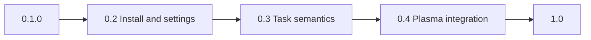

# Kurrent roadmap

Path from **0.1.0** to **1.0**: a daily-driver Plasma widget that installs without compiling from git, behaves like Nextcloud/KOrganizer for VTODO, is usable from the keyboard, and has a power-user settings dialog.

Out of scope for 1.0: Kanban, swimlanes / calendar grid, habit streaks, merging tasks with calendar events, Markdown notes, attachments, a login of its own, a theme engine besides Plasma, or free-form pixel padding.

## 0.1.0 today

Inbox, Today, Tomorrow, Scheduled, Anytime, Recurring, Unlabeled, Completed. Projects, labels, priorities. Create, edit, complete, delete. Subtasks via drag-and-drop. Full editor overlay and inline editor. Shared config between desktop and panel. Translations (de, es, fr, ja, zh_CN). A `.plasmoid` asset on GitHub Releases.

Configure Kurrent currently has three pages: **General** (default view, completed tasks, blur, sidebar row size, new-task project), **Projects** (enable/hide), **Labels** (hide). Almost everything else is fixed in `Design.qml` and `colors.js`.

Settings stay **shared** across desktop widget and panel flyout (`~/.config/com.github.shrippen.kurrent/kurrentrc`). Spacing still comes from `Design.qml` tokens; user overrides (sidebar width in grid units, density) are read there. Project/label colors default to the hash in `colors.js` unless overridden.

---

## 0.2 — Installable + settings foundation

Without a distro package, 1.0 is still `./install.sh` only.

- AUR `kurrent` (CMake plugin + plasmoid). The `.plasmoid` zip is the widget UI for the KDE Store; it does not replace `libkurrentplugin.so`.
- Honest release notes; `ctest` in CI.
- Persist sort mode in `kurrentrc`.
- Empty/error UI when Akonadi is missing or no todo collections are enabled.
- **Catch-up in Today:** unfinished tasks from recent days sit in a distinct *Still open* / catch-up block at the top of Today. They are not silently mixed into “due today”, and they do **not** auto-rollover onto tomorrow. Optional Overdue view in the sidebar; catch-up on/off in settings.
- Settings shell: new KCM categories (Appearance, Sidebar, Tasks, Editor, Panel), config keys, per-page reset to defaults. `Design.qml` reads sidebar width and density overrides.

---

## 0.3 — CalDAV semantics + task/editor settings

- Completing a recurring task advances the series (or records an exception) without wiping a custom `RRULE`.
- `VALARM` in the editor, Plasma notifications when due. Snooze from the notification (15 min / 1 h / tomorrow) rewrites the alarm and optionally the due date.
- **Reschedule (punt):** context menu or row action — +15 min … +4 h, tomorrow, pick a day — writes `due` (and start if needed). Complements catch-up: overdue is a prompt to decide, not only a red chip. Covered by the one-step undo.
- **Day sections:** set `KURRENT/LIST` (or equivalent) from the editor; Today / Scheduled group by heading. Configurable Morning / Afternoon / Evening hour bounds in settings so timed tasks fall into day parts without a full calendar.
- Quick add, e.g. `Milk tomorrow 18:00 !high #errands`.
- Collapse/expand subtask trees; optional “complete parent completes children”.
- Rename labels (rewrite `CATEGORIES` on all matching todos).
- One-step undo for delete / complete / move / reschedule.
- KCM: row chips, click vs double-click, editor defaults, default reminder, catch-up, day-part hours.

Not in 0.3: creating Akonadi calendars from the widget, attachments, attendees.

---

## 0.4 — Plasma citizen + chrome settings

- Keyboard: focus search, new task, complete, delete, full editor, view switching, reschedule shortcuts.
- Global shortcut / D-Bus to open the flyout or add a task.
- KRunner (`task tomorrow invoice`) — nice to have, not a 1.0 blocker.
- **Join button:** a `http(s)` meeting URL in the description (or location) shows as a compact Join control on the row and in the editor, not a full-width link.
- Sidebar width, section/view order and visibility; per-project and per-label colors; panel badge and flyout size; overlay dim steps.

---

## Settings catalog (1.0)

Target KCM pages:

1. **General** — startup, completed tasks, new tasks, confirmations, clicks
2. **Appearance** — blur, density, overlay, reduced motion
3. **Sidebar** — width, sections, views on/off and order, row size
4. **Tasks** — sort, row chips, date format, tree
5. **Editor** — inline vs full, default fields, reminder offset
6. **Panel** — badge, tooltip, flyout size
7. **Projects** — enable/hide + color
8. **Labels** — hide + color (rename once 0.3 exists)
9. **Notifications** — once alarms exist
10. **Shortcuts** — documented bindings; remap through Plasma where possible

Each page has reset-to-defaults. Desktop and panel stay in sync.

### General

- Start on a fixed default view **or** remember the last view.
- Catch-up block in Today on/off; how many past days to include.
- Completed tasks: hide / dim in the list / only in the Completed view.
- New task with no sidebar project: ask / first visible / fixed project (already exists).
- Default due date when creating: none / today / tomorrow / in N days.
- Delete immediately (today) or confirm.
- Click: inline editor / full editor / select only; double-click does the other.
- Checkbox: complete immediately, or only with a modifier.
- Search: title+description+labels (today) or title only; case sensitivity.
- Sync: manual (today) or interval in minutes (`syncNow`; Akonadi remains the live source).

### Appearance

- Blur on/off (already exists).
- Density compact / comfortable / touch-auto for **sidebar and task rows**.
- Overlay dim and card inset as a few steps, not unbounded sliders.
- Reduced motion (no spinner, no hover flash).
- Optional 0/1/2-line description preview on the row.

### Sidebar

- Width in grid units (currently fixed at 10).
- Show/hide and reorder: Views, Projects, Labels, Priorities.
- Show/hide and reorder individual views (including optional Overdue after 0.2; Catch-up is a Today block, not a separate view unless enabled).
- Row size auto / compact / comfortable (already exists).
- Show empty projects; show/hide counts.

### Tasks

- Persistent sort (currently RAM-only).
- Per-chip toggles: date, labels, priority, percent complete, location, recurring icon, Join button.
- Relative dates vs locale date; time on the row on/off.
- Overdue emphasis via the due chip, not a second palette. Reschedule presets (tomorrow / +1 day / pick date / snooze offsets).
- Subtask indent in grid units; default collapsed/expanded.
- Section headers when a `KURRENT/LIST` property is set; Morning / Afternoon / Evening hour bounds.

### Editor

- Always inline, always full, or compact first with a full-editor button.
- Which inline fields (description, due, priority, labels).
- Fold status / secrecy / location / percent / recurrence / day-section (`LIST`) in the full editor.
- Default all-day when a date has no time.
- Default reminder: off / at due / N minutes before (needs 0.3).
- Default recurrence preset.

### Panel

- Badge: off / open roots / today only / overdue only / unread reminders.
- Tooltip: count / next due title.
- Flyout preferred size (currently about 32×24 grid units).
- Icon: mask (today) vs color app icon.

### Colors

- Color button per project id and label name; empty means hash as today.
- Reset one color or all.
- Priority stays the 1–3 / 4–6 / 7–9 bands; no nine separate pickers in 1.0.

### Notifications (after 0.3)

- Desktop notifications on/off, quiet hours.
- Reminder vs overdue vs morning digest.
- Snooze actions on the notification (15 min / 1 h / tomorrow).
- Click opens flyout or full editor.

### Shortcuts

- Search, new, complete, delete, editor, reschedule, views 1–9 listed in the KCM.
- Remap via Plasma shortcuts where possible; otherwise widget defaults.

---

## 1.0 ship criteria

1. Install without git (AUR or equivalent) plus Store `.plasmoid` with a clear plugin note.
2. Nextcloud round-trip: create, due, label, subtask, recur, complete the series, reminder — visible in Merkuro/Nextcloud and back.
3. Keyboard-only daily use in the widget.
4. All KCM pages above, with reset; desktop and panel identical.
5. Translations, changelog, settings screenshots.
6. Tests: recurrence complete, alarm round-trip, quick-add parser, catch-up / overdue, reschedule undo, `SharedSettings` round-trip.

## After 1.0

- **Swimlanes:** a dated source (tag, project, saved filter) unfolds into parallel lanes; columns adapt from days to weeks to months. Compact heat strip of busy days; tap a date header to jump to that day in Today. Needs a real time axis, not the 1.0 list widget.
- **Streak / heatmap:** habit-style recurring todos with a completion calendar (year/month), snooze a day, optional “skip doesn’t break the streak”.
- **Task ↔ event:** convert a VTODO into an Akonadi calendar event (and back), or show the day’s events beside tasks without leaving the widget. Two MIME types; keep CalDAV round-trip honest.
- Kanban, Markdown notes, attachments, comments
- Saved smart filters, pins, multi-select
- Per-instance settings (desktop different from panel)
- Nine custom priority colors, padding in raw pixels
- CalDAV without Akonadi, Flatpak

## Build order

Settings keys and empty KCM pages in parallel with 0.2 packaging and Today catch-up. Reschedule, day sections, and alarms with 0.3. Appearance, sidebar, panel, Join button, and colors with 0.4. KRunner last. Swimlanes, streaks, and task/event conversion after 1.0.
